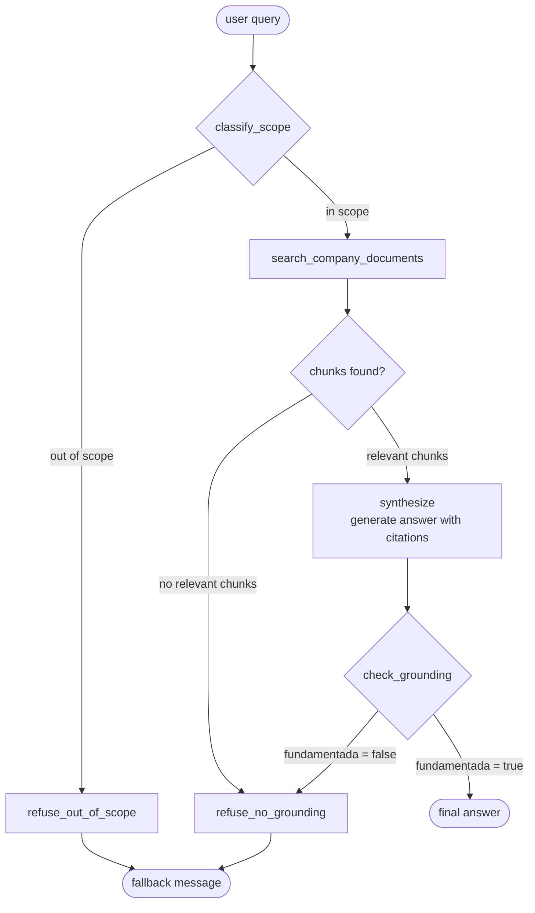
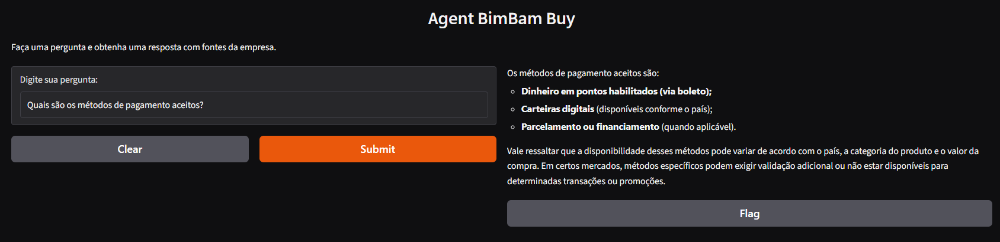
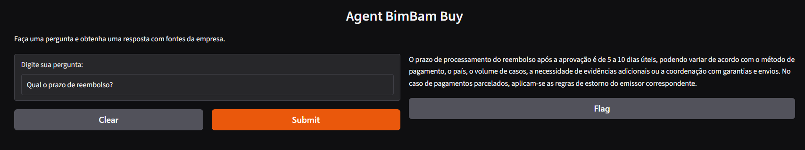
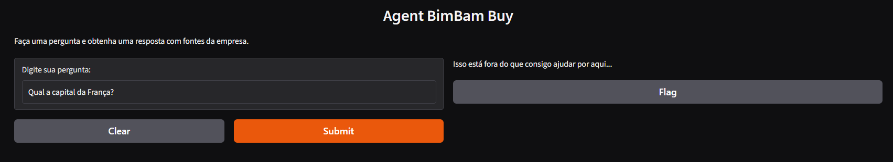
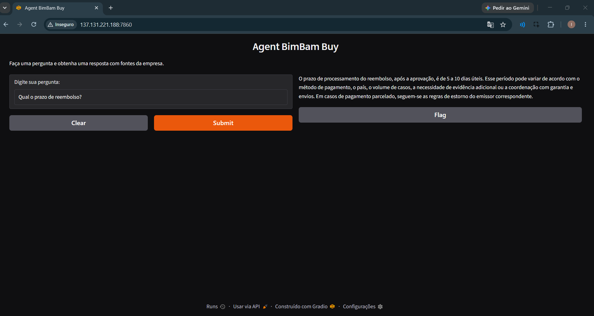
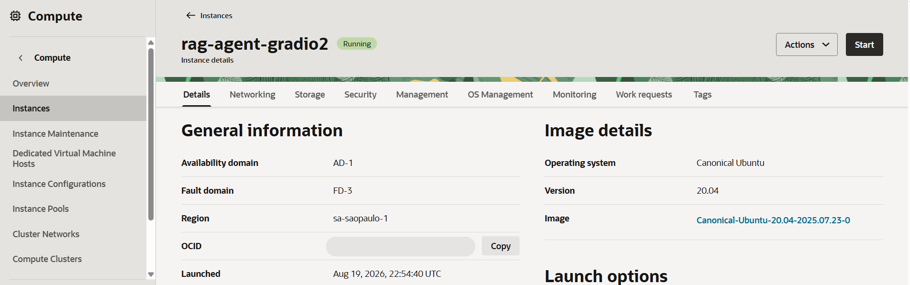

# RAG Agent for Company

An artificial intelligence agent that answers questions based on a company's documents. Developed for the Alura Agent Challenge and Oracle's One AI For Tech program.

## Description

The agent uses Retrieval Augmented Generation (RAG) to search over the company's PDF content. Questions that fall outside the agent's scope, or that cannot be grounded in the retrieved documents, are handled via fallback messages, preventing fabricated answers.

## Agent Graph



**Flow summary:**
 
1. **`classify_scope`** – classifies whether the question falls within the company's supported domains (envio, garantia, pagamento, afiliados, reembolsos) and, when confidence is high, narrows the search to specific categories.
2. **`search_company_documents`** – runs a similarity search against the vector store (Chroma), scoped to the classified categories when confidence is high.
3. **`synthesize`** – generates an answer strictly grounded in the retrieved chunks, with citations.
4. **`check_grounding`** – verifies that every claim in the generated answer is actually supported by the retrieved context.
5. If the question is out of scope, no relevant chunks are found, or the answer fails the grounding check, the agent returns a fixed fallback message instead of improvising.


## Tecnologies and Tools
- Python
- LangChain / LangGraph
- Chroma (vector store)
- Google Gemini (LLM) via `langchain-google-genai`
- HuggingFace Embeddings (`sentence-transformers/paraphrase-multilingual-mpnet-base-v2`)
- Gradio (interface)
- Docker
- Oracle Cloud Infrastructure (OCI) for deploy

## How to Run?

### Local (without Docker)

```bash
# Create and activate a virtual environment
python -m venv .venv
.venv\Scripts\Activate.ps1   # Windows
# source .venv/bin/activate  # Linux/macOS
 
# Install dependencies
pip install -r requirements.txt
 
# Create a .env file in the project root with:
# GEMINI_API_KEY=your_google_gemini_api_key
# GEMINI_MODEL=gemini-model-name
# HF_TOKEN=your_huggingface_token
 
# Run the app
python src/main.py
```

The interface will be available at `http://127.0.0.1:7860`.

### With Docker

```bash
# Make sure .env is present in the project root (same variables as above)
 
docker compose up --build
```

The interface will be available at `http://localhost:7860`.

> **Note:** the first run processes and embeds all PDF documents in `data/raw` into the Chroma vector store, which can take a while depending on the number/size of documents.

## Example of questions

- "Quais são os métodos de pagamento aceitos?"
- "Qual o prazo de reembolso?"
- "Qual a capital da França?" *(out-of-scope example, triggers fallback)*

## Example of generated answers







## Deploy in OCI

- **Public link:** [link of the application](http://137.131.221.188:7860/)
- **Screenshot of the application:** 






## Next steps

- Improve deployment by configuring Cloudflare (proxy + DNS) to hide the server's real IP and get free HTTPS
- Improve front-end (Gradio UI/UX, custom theme, better error handling in the interface)
- Add logging/observability for the LangGraph agent (e.g. LangSmith tracing) to debug retrieval and reasoning steps
